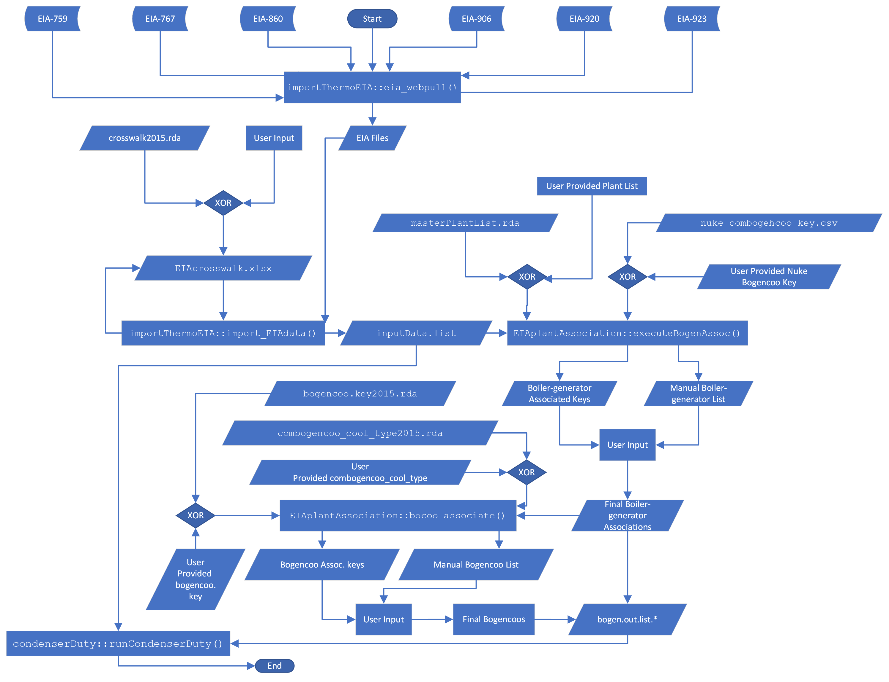

```{r setup, include=FALSE}
knitr::opts_chunk$set(echo = TRUE)
```

## Generalized Workflow 
Below is a generalized workflow. Numbers below will be references in
subsequent sections with more detail included.

1. Load R packages (condenserDuty and EIAplantAssociation);
2. Pull EIA Data from Web;
    a. Iteratively Update Input <-> Code Crosswalk;
    (`UserControlCrosswalk2015.xlsx`)
    b. Format Relevant EIA Data;
3. Initialize Boiler-Generator Associations;
    a. Manually Check Select Boiler-Generator Associations;
    b. Apply Manual Updates to Boiler-Generator Associations;
4. Create Cooling-System Groups;
    a. Manually Check Select Cooling-System Groups;
    b. Apply Manual updates to Cooling-System Groups;
5. Run CondenserDuty Model;
6. Run FEWSR/Tower Preparation;
    a. Python Preparation;
    b. `formatENV.R`;
    c. `Prep_FEWSR_loop.R`;
    d. `Prep_Tower_loop.R`;
7. Run FEWSR Model;
8. Run Tower Model;
9. Run Post-Processing of Results.

## Section 1: Loading R Packages
The version of R recommended for this analysis is
[R-4.1.1](https://cran.microsoft.com/snapshot/2021-10-25/bin/windows/base/).
[Rtools40](https://cran.microsoft.com/snapshot/2020-07-16/bin/windows/Rtools/)
must also be installed to load prerequisite packages.

In order to have access to all functions required to run
cooling-system groups (commonly abbreviated "bogencoo" in code), and
calculate condenser duty, the condenserDuty and
EIAplantAssociation packages must be loaded. To load them, run the
following lines:

```{r, echo=TRUE,eval=FALSE}
install.packages("remotes")

remotes::install_github(auth_token = "***",
                        repo="https://github.com/rniswon/Thermoelectric",
                        subdir="importThermoEIA",
                        build_vignettes = T)
```

where `***` is your (classic) [GitHub personal access
token](https://docs.github.com/en/authentication/keeping-your-account-and-data-secure/creating-a-personal-access-token) for the `Thermoelectric` repo.

The first time the packages are loaded, many prerequisite packages
will be installed and the process will take a few minutes, but in
subsequent runs only the condenserDuty and EIAplantAssociation
packages will be loaded.

In order to run "Section 9: Post-Processing of Results", you must also
load the [remotes](https://cran.r-project.org/web/packages/remotes/index.html)
and [smwrBase](https://github.com/USGS-R/smwrBase) packages. smwrBase
is *not* on CRAN and therefore cannot be loaded as a CRAN package. To
load smwrBase use the code below:

```{r, echo=TRUE,eval=FALSE}
# install the remotes package
install.packages("remotes")

# install smwrBase from CHS GitLab
remotes::install_gitlab("water/analysis-tools/smwrBase",
                        host = "code.usgs.gov")
```

## Section 2: Pull EIA Data From Web
Once the condenserDuty and EIAplantAssociation packages are loaded,
functions to aid in pulling and formatting EIA data from the web will
be accessible. To pull EIA data for a given year on or after 2000, use
the following code:

```{r, echo=TRUE,eval=FALSE}
# directory where raw EIA pulled from the web will be saved
EIAsaveOut <- "D:/"

# specify which year's data to pull
eia_year <- 2015

# path to save EIA data for given year (can be same as EIAsaveOut)
# directory inside this directory named with the eia_year (i.e. 2015)
EIAyearSave <- paste0(EIAsaveOut, "EIA_", eia_year)

# run import module function
eia_webpull(eia_year, EIAyearSave)
```

The raw EIA data is significantly different for each year, therefore,
in order to use the data, it must first be put into a standardized
format. The condenserDuty package contains functions to aid the user
in formatting the EIA data for use. The `import_EIAData()` function
uses the input file from
[`UserControlCrosswalk2015.xlsx`](https://github.com/rniswon/Thermoelectric/blob/master/cd/TutorialFiles/UserControlCrosswalk2015.xlsx). This
file contains *all* required data columns to run the full workflow and
is built for the year 2015.

### How the UserControlCrosswalk Works
EIA data changes file names, sheet names, file types, and column names
every year making it very difficult to write code that uses this
data. To combat this problem a crosswalk file was created to map
required data from raw EIA input names/types to tables and columns
used by the program. If you open the
[`UserControlCrosswalk2015.xlsx`](https://github.com/rniswon/Thermoelectric/blob/master/cd/TutorialFiles/UserControlCrosswalk2015.xlsx)
spreadsheet, you will see the following columns:

1. `InputFile` - Name of EIA input file;
2. `InputSheetName` - Name of sheet in `InputFile` to be used;
3. `InputSheetDescription` - Description of data needed for a given
   table in the code (`scriptTableName`);
4. `InputColumnName` - Name of column in `InputSheetName`
5. `InputColumnDescription` - Description of data needed for given
   column in code (`scriptColumnnames`);
6. `scriptImportFunc()` - Function used to import and format data;
7. `scriptTableName` - Name of table used by the code;
8. `scriptColnames` - Name of columns in `scriptTableName` that are
   standardized.

Only columns `InputFile`, `InputSheetName`, and `InputColumnName`
should be edited. Editing any columns that begin with `script` will
cause the program to fail. All columns of any given `InputSheetName`
will be accessible, but *only* columns listed in `InputColumnName`
will be standardized and replaced by `scriptColnames`.

At first glance this table seems daunting, but there are built-in
tools to aid the user in editing the file. To begin, close the
[`UserControlCrosswalk2015.xlsx`](https://github.com/rniswon/Thermoelectric/blob/master/cd/TutorialFiles/UserControlCrosswalk2015.xlsx)
spreadsheet and run the following code:

```{r, echo=TRUE,eval=FALSE}
# path to crosswalk being used to start
path_InputData_Metafile <-
  paste0(repoPath, "cd/TutorialFiles/UserControlCrosswalk2015.xlsx")

# path to EIA raw data
# path should be to directory with extracted data from ZIP files
# (created by eia_webpull)
path_EIAInputData <- paste(EIAyearSave, eia_year, sep = "/")

# if saving formatted tables as csv set outputCSV <- TRUE; otherwise
# outputCSV <- FALSE
outputCSV <- TRUE

# path to save formatted tables in CSV form (set
# path_outputCSV <- NA, if outputCSV <- FALSE)
path_outputCSV <- EIAyearSave

# execute import_EIAData() for the first time
inputData.list <-
  import_EIAData(path_InputData_Metafile,
                 path_EIAInputData,
                 outputCSV,
                 path_outputCSV)

```

Most likely on the first execution, you will see the following in the
console:

```
> inputData.list<-import_EIAData(path_InputData_Metafile,path_EIAInputData,outputCSV,path_outputCSV)
[1] "Please review the Input Data Metafile for highlighted errors."
```

This indicates that changes to the crosswalk are required to format
the required data properly. Open the
[`UserControlCrosswalk2015.xlsx`](https://github.com/rniswon/Thermoelectric/blob/master/cd/TutorialFiles/UserControlCrosswalk2015.xlsx)
and see what has been highlighted. Highlighted items could *not* be
found and must be manually replaced by the user. The
`import_EIAData()` function is iterative in that it checks the
[`UserControlCrosswalk2015.xlsx`](https://github.com/rniswon/Thermoelectric/blob/master/cd/TutorialFiles/UserControlCrosswalk2015.xlsx)
from left to right, if problems are found in a given column the
function highlights them, and stops checking other columns. This makes
sense because, if columns to the left are not found, everything to the
right of that column would also not be found.

The user should replace any fields highlighted in yellow, save and
close the
[`UserControlCrosswalk2015.xlsx`](https://github.com/rniswon/Thermoelectric/blob/master/cd/TutorialFiles/UserControlCrosswalk2015.xlsx)
spreadsheet, and repeat the following line until this is displayed in
the console:

```
> inputData.list<-import_EIAData(path_InputData_Metafile,path_EIAInputData,outputCSV,path_outputCSV)
[1] "bogen"
Test passed
[1] "bocoo"
Test passed
[1] "gen_860"
Test passed
[1] "retiredGenerators"
[1] "generation.data"
Test passed
[1] "boilerFuelData"
Test passed
[1] "gen_fuel_data"
Test passed
[1] "boilerDesignData"
Test passed
[1] "cooling"
Test passed
[1] "plantInfo"
Test passed
[1] "cooling8D"
Test passed
```

```{r, echo=TRUE, eval=FALSE}
# execute import_EIAData
inputData.list <-
  import_EIAData(path_InputData_Metafile,
                 path_EIAInputData,
                 outputCSV,
                 path_outputCSV)
```

It is recommended that the user save a copy of their completed
crosswalk in an alternate location for future use.

If you have previously generated a crosswalk file, it is recommended
that you begin with an existing crosswalk that is for the year closest
to your current analysis year. For example, if you are trying to run
2010 and have access to a working crosswalk for 2020, replace the
[`UserControlCrosswalk2015.xlsx`](https://github.com/rniswon/Thermoelectric/blob/master/cd/TutorialFiles/UserControlCrosswalk2015.xlsx)
spreadsheet with your working 2020 crosswalk.

### The `inputData.list` Object
The `import_EIAData()` function outputs a list of all tables used by
the program, with standardized names for all required columns, and
original names for all other columns. Table descriptions are in the
`InputSheetDescription` column of the
[`UserControlCrosswalk2015.xlsx`](https://github.com/rniswon/Thermoelectric/blob/master/cd/TutorialFiles/UserControlCrosswalk2015.xlsx)
spreadsheet. To view a table from this list, use the following code:

```{r, echo=TRUE,eval=FALSE}
# replace 'boilerFuelData' below with any table name from scriptTableName
View(inputData.list$boilerFuelData)
```

### Import the Master Plant List and `nuke_combogencoo_key` Static Tables
The Master Plant List was developed as a way to select only those
plants that are suitable for the type of analysis that is executed by
this program. *Only* plants found on the Master Plant List should be
used. To import the Master Plant List use the following code:

```{r, echo=TRUE,eval=FALSE}
# import master plant list
plantList <-
  openxlsx::read.xlsx(paste0(repoPath, "cd/TutorialFiles/TE_MPL_allyears.xlsx"),
                      sheet = "plant years vert")

# format Plant.Code column
plantList$Plant.Code <- plantList$EIA_PLANT_ID

# select only plants for the year being analyzed
plantList <- plantList[plantList$year == eia_year, ]

# add plantList to inputData.list (MUST be called plantList for execution to
# continue)
inputData.list$plantList <- plantList

```

`nuke_combogencoo_key` is a largely static key that associates nuclear
units to cooling systems. This key can be edited manually if
necessary. More details on how cooling systems are associated in
"Section 4: Generate Cooling-System Groups". At this point in the
program, this table is largely used to select nuclear plants. Import
the `nuke_combogencoo_key` using the following code:

```{r, echo=TRUE,eval=FALSE}
# import nuke_combogencoo_key
nukePlants <-
  read.csv(paste0(repoPath, 'cd/TutorialFiles/nuke_combogencoo_key.csv'))

# add nukePlants (MUST be called nukePlants for execution to continue)
inputData.list$nukePlants <- nukePlants
```

## Section 3: Create Boiler-Generator Associations
Since the data required to calculate fuel heat is reported by boiler,
and net generation is reported by generator, in order to calculate
condenser duty, the EIA data reported by boiler must be associated
with the EIA data reported by generator. This is called a
"boiler-generator association" (commonly abbreviated "bogen" in
program code). EIA reports associations between boilers and generators
in the `bogen` table from the `inputData.list`, however, there are
many boilers and generators that are missing from the EIA
boiler-generator association table. Thus, the EIAplantAssociation
package was developed.

### executeBogenAssoc() Function
The `executeBogenAssoc()` function uses the EIA boiler-generator
association table to initialize boiler-generator associations,
then uses the `gen_860`, `retiredGenerators`, `generation.data`,
`boilerFuelData`, `gen_fuel_data`, and `boilerDesignData` from the
`inputData.list` to fill in missing boiler-generator associations
using `Unit.Code` associations, string associations, and (`CA-CT`,
`Prime.Mover`) pair associations.

#### Plant-level Boiler-Generator Associations
In certain cases, EIA data is incomplete in the `boilerFuelData` table
and/or the `generation.data` table. The first common case identified
is when a plant's data is reported only in December. The program calls
these "Decembrists". Decembrists report an annual sum in the month of
December. However, for many Decembrists, monthly values at the
`Plant-Reported.Prime.Mover` level are reported in `gen_fuel_data`
(from [EIA-923](https://www.eia.gov/electricity/data/eia923/), Page 1
Generation and Fuel Data). If monthly data is available in
`gen_fuel_data` for a Decembrist, the boiler-generator association is
set to `(Plant.Code)^NGCC` for Reported.Prime.Movers of `CA`,`CT`, or
`CS` and `(Plant.Code)^ST` for Reported.Prime.Movers of `ST`.

The second common case in which data is incomplete in `boilerFuelData`
and/or generation data is when only the `CA` portion of a NGCC unit is
reported. However, the `CT` portion of the unit is often available in
`gen_fuel_data` (from EIA-923, Page 1). A boiler-generator association
of `(Plant.Code)^NGCC` is assigned to these plants.

Boiler-generator associations that take the form `(Plant.Code)^NGCC`
or `(Plant.Code)^ST` serve as an indicator to the CondenserDuty model
that they should be analyzed using data from `gen_fuel_data` at the
`Plant-Reported.Prime.Mover` level rather than at the boiler-generator
level.

#### Complex Nuclear Boiler-Generator Associations
The boiler-generator association step designed to link boilers and
generators for non-nuclear units. Nuclear associations are generally
static and can be found in
[`nuke_combogencoo_key.csv`](https://github.com/rniswon/Thermoelectric/blob/master/cd/TutorialFiles/nuke_combogencoo_key.csv). However,
there are some plants that have both nuclear and non-nuclear units,
like Plant.Code 621, Turkey Point. For plants that contain both
nuclear and non-nuclear units, boiler-generator associations will be
assigned to the non-nuclear units, and will be formatted like
`(Plant.Code)^(bogen unit number).NonNuke` to distinguish them from
static nuclear units.

To run boiler-generator associations, use the code below:

```{r echo=TRUE,eval=FALSE}
# path to CondenserDuty input data files
inputData_path <- paste0(repoPath, "/cd/TutorialFiles/")

# path to save boiler-generator association output (path must exist)
pathWrite <- "D:/bogenAssociationOutput/"

# run boiler-generator associations
#
# select_RPM argument is used to filter input data so that only
# Reported.Prime.Movers in select_RPM are considered
bogen.out.list <-
  executeBogenAssoc(
    inputData_path,
    pathWrite,
    inputData.list,
    select_RPM = c("CA", "CS", "CT", "ST", NA),
    eia_year
  )

# Saving the bogen.out.list for future use is highly recommended.
# Sys.Date() will attached the date that the file is saved to the file
# name.
save(bogen.out.list,
     file = paste0(pathWrite, "bogen.out.list.", eia_year, "_", Sys.Date()))

```

#### The `bogen.out.list` Object
The `executeBogenAssoc()` function outputs a list object defined above
as the `bogen.out.list`. The `bogen.out.list` contains the following
objects:

1. `sheet3_key` - Table that associates unique boilers to
   boiler-generator associations. It is named after the 2015, EIA-923,
   Page 3 Boiler Fuel Data table from which `boilerFuelData` is sourced.
2. `sheet4_key` - Table that associates unique generators to
   boiler-generator associations. It is named after the 2015, EIA-923,
   Page 4 Generator Data table from which `generation.data` is sourced.
3. `missingCSCT` - Table output of the `checkMissingCSCT()` function
   which checks for `CS` and/or `CT` Reported.Prime.Movers that are
   present in `gen_fuel_data` (EIA-923, Page 1) from `inputData.list`
   but missing from `boilerFuelData` (EIA-923, Page 3) and/or
   `generation.data` (EIA-923, Page 4). Column naming is based on the
   page number of the data on the EIA-923 form. `gen_fuel_data` is
   reported at the plant level and therefore is not ideal for this
   type of analysis, however, if data exists in `gen_fuel_data` and
   not in `boilerFuelData` or `generation.data` then `gen_fuel_data`
   is used for the analysis. For NGCC units that fall into this
   category a boiler-generator association of `(Plant.Code)^NGCC` will
   be assigned.
4. `manualPlants` - Table of all plants flagged for manual
   boiler-generator association checks and columns for all manual
   flags indicating why the plant was selected for manual checks.
5. `NA.Boiler.ID` - Table of all generators that were not associated
   with a boiler by the automated boiler-generator association process.
6. `Boiler.ID_NotAssoc` - Table of boilers found in `boilerFuelData` that
   could not be associated with a generator
7. `bogen.key` - Table of all generators and boilers assigned to
   boiler-generator associations with all data flags
8. `binary_Auto3` - Table of unique boilers assigned to
   boiler-generator associations with all flags converted to binary 0
   or 1. `plant_bo` is `(Plant.Code)^(Boiler.ID)`
9. `binary_Auto4` - Table of unique generators assigned to
   boiler-generator associations with all flags converted to binary 0
   or 1. `plant_gen` is `(Plant.Code)^(Generator.ID)`
10. `bf.923.ungrouped` - Table of monthly fuel heat by line from
    `boilerFuelData`
11. `generation.data.line124` - Table of monthly net generation by line
    of `generation.data`
12. `bfd.gb` - Table of monthly fuel heat by summed by boiler
13. `generation.data.gb` - Table of monthly net generation summed by
    generator
14. `sumFuelHeatByBogen` - Table of fuel heat summed by
    boiler-generator association
15. `sumNetGenByBogen` - Table of net generation summed by
    boiler-generator association
16. `thermalEffByBogen` - Table of monthly thermal efficiencies summed
    by boiler-generator association. Thermal efficiency is defined as
    3.41214 * NetGeneration / FuelHeat. If NetGeneration <= 0 and
    FuelHeat <= 0, Thermal Efficiency is set to 0. If
    NetGeneration > 0 and FuelHeat <= 0, Thermal efficiency is set to
    9999.

### Boiler-Generator Association Questionable Data Flags
The program also generates a series of flags to aide the user in
evaluating the resulting boiler-generator associations. These are
described in the input file
[`ColumnLegend_metafile.xlsx`](https://github.com/rniswon/Thermoelectric/blob/master/cd/TutorialFiles/ColumnLegend_metafile.xlsx).
Most flags are simply informative, however, the highlighted flags have
additional functionality. The red flags indicate that rows should be
removed automatically by the `executeBogenAssoc()` function, and the
green flags indicate that that any plant with any one of those flags
should be separated out for manual data checks.

#### Red Automatic Removal Flags
These flags were created to remove data associations that are
erroneous or cannot be completed. See descriptions below.

1. `missing.from.923` - Indicates that a given generator and/or boiler
   is not present in the generation.data *and* is not present in the
   `boilerFuelData` from the `inputData.list`;
2. `Boiler.Status` - Indicates that the `Boiler.Status` column in
   `boilerDesignData` from the `inputData.list` is one of the following
   values: `OA`, `OS`, `RE`; which indicates that the boiler is no
   longer in use;
3. `missing.bf.923` - Indicates that a given boiler is not present in
   the `boilerFuelData` from the `inputData.list`;
4. `missing.generation.data` - Indicates that a given generator is not
   present in the generation.data from the `inputData.list`.

#### Green Manual Boiler-Generator Association Flags
These flags identify questionable data that could indicate a incorrect
association, and needs a manual check to verify that the
boiler-generator association association has been properly
assigned. All plants with any one of these flags will be output into a
separate manual check document that has been designed to aid the user
in this verification process. Further discussion on manual checks to
follow. Below are the manual boiler-generator association flags. For
boiler-generator associations, Fuel Heat is defined as
Quantity.Of.Fuel.Consumed.(month)*MMbtu.Per.Unit.(month) from
`boilerFuelData` in the `inputData.list` and Net Generation is from
the `generation.data` in `inputData.list`.

1. `missingPlant.assoc` - Indicates that the plant is not found in the
   EIA boiler-generator association table. Since this is the best source of
   association data, if a plant is not present there a manual check is
   warranted;
2. `flagCACT.missingPair` - Natural Gas Combined Cycle (NGCC) plants
   operated normally should have both `CA` and `CT`
   Reported.Prime.Movers within a given boiler-generator association,
   if only one or the other is found, the boiler-generator association
   is incomplete and a manual check is required;
3. `flag_923bogenCTonly` - Indicates that in the only
   `Reported.Prime.Mover` in the `generation.data` and the
   `boilerFuelData` from the `inputData.list` is `CT`;
4. `flagNetGenWithoutFuelHeat` - Count of months where net generation
   is greater than zero, but is less than zero at the plant level;
5. `flagFuelHeat` - Indicates whether monthly fuel heat summed to the
   plant level by line in `boilerFuelData` from `inputData.list`, is
   different in any one month from fuel heat summed by
   boiler-generator association to the plant level;
6. `flag_STassoc_CT_CS_CA` - Indicates an `ST` Reported.Prime.Mover has
   been put in the same boiler-generator association as a `CT`, `CA`,
   or `CS` `Reported.Prime.Mover`. `ST` indicates a steam system, which
   should never be associated with NGCC units;
7. `flag_CSassociation` - Indicates that a combined-cycle-single-shaft
   (`CS` `Reported.Prime.Mover`) has been associated with another
   `Reported.Prime.Mover.` `CS` should not be associated with any other
   `Reported.Prime.Mover` type;
8. `flag.NGCC.badFuel` - Indicates that an NGCC unit has a
   `Reported.Fuel.Type.Code` from the following list: `BIT`, `AB`,
   `ANT`, `GEO`, `LIG`, `MSB`, `MSN`, `OBS`, `PC`, `PUR`, `RC`, `SGC`,
   `SGP`, `SLW`, `SUB`, `TDF`, `WAT`, `WC`, `WDS`, `WH`, or
   `WND`. These fuel types should not be associated with NGCC units.

### Generate Compiled Manual Boiler-Generator Associations File Using `compilePlantInfo_excel()`
After the automated boiler-generator association process is complete,
the user must evaluate all plants flagged for manual checks on
boiler-generator associations. There are functions available to aid
the user in this process. The `compilePlantInfo_excel()` function
creates a file with a tab for each plant selected (recommend selecting
all `manualPlants` from `bogen.out.list`) with all tables selected by
the user that are available in the user's environment for that
plant. An example file is
[`compiled_ManualBogens.xlsx`](https://github.com/rniswon/Thermoelectric/blob/master/plant_association/compiled_manualBogens.xlsx).

#### The `compilePlantInfo_excel()` Function
The `compilePlantInfo_excel()` function was designed to flexible so
that the user can select what data is most important for their
evaluation. Function arguments are as follows:

1. `outputPath` - path (including file name) where compiled file
   should be saved;
2. `plantList` - unique vector of Plant.Codes to be included in the
   file (recommend all `manualPlants` from `bogen.out.list`);
3. `outTables` - list of named tables to be included in
   file. `Plant.Code` column must be present to include table. Two
   tables should always be included `auto_sheet3_key` and
   `auto_sheet4_key` which correspond to the
   `bogen.out.list$sheet3_key` and `bogen.out.list$sheet4_key`,
   respectively. In order for the user's manual edits to be
   automatically applied these two tables must be present and must be
   named `auto_sheet3_key` and `auto_sheet4_key`. All other tables in
   the file are up to the user to select;
4. `shiftCols` - number of columns to shift tables not named
   `auto_sheet3_key`, `auto_sheet4_key`, `auto_bogencoo.key`, or
   `combogencoo_cool_type_key` to better line up data (recommended set
   equal to `1`);
5. `inputData_path` - Path to `Thermoelectric/cd/TutorialFiles`;
6. `fileComment` - character string to be put on the first tab of the
   file uniquely identifying the file.

To execute the `compilePlantInfo_excel()` function use the following
code, adjusting the function arguments as desired:

```{r, echo=TRUE,eval=FALSE}
# define list of output tables to include
outTables <- list(
  auto_sheet3_key = bogen.out.list$sheet3_key, # required
  auto_sheet3_flags = bogen.out.list$binary_Auto3,
  auto_sheet4_key = bogen.out.list$sheet4_key, # required
  auto_sheet4_flags = bogen.out.list$binary_Auto4,
  EIA_associationTable = inputData.list$bogen,
  generator.data.860 = inputData.list$gen_860,
  retiredGenerators.860 = inputData.list$retiredGenerators,
  Boiler_InfoDesign_Parameters.860 = inputData.list$boilerDesignData,
  boilerFuelData_923 = inputData.list$boilerFuelData,
  generation.data.923 = inputData.list$generation.data,
  page1GenFuelData.923 = inputData.list$gen_fuel_data,
  FuelHeatByLine = bogen.out.list$bf.923.ungrouped,
  NetGenByLine = bogen.out.list$generation.data.line124,
  FuelHeatByBoilerID = bogen.out.list$bfd.gb,
  NetGenByGeneratorID = bogen.out.list$generation.data.gb,
  FuelHeatByBogen = bogen.out.list$sumFuelHeatByBogen,
  NetGenByBogen = bogen.out.list$sumNetGenByBogen,
  ThermalEfficiencyByBogen = bogen.out.list$thermalEffByBogen
)

# create a compiled file
compilePlantInfo_excel(
  outputPath = paste0(pathWrite, "compiled_manualBogens_", eia_year, ".xlsx"),
  plantList = unique(bogen.out.list$manualPlants$Plant.Code),
  outTables = outTables,
  shiftCols = 1,
  inputData_path,
  fileComment = "All Plants flagged with manualFlags"
)
```

The output file generated by `compilePlantInfo_excel()` will have a
list of all the plants contained in the file on the first tab, and a
tab named with the `Plant.Code` for all plants on the list. On the
`Plant.Code` tabs, all tables selected by the user will be present.

### Making Manual Boiler-Generator Association Edits
The output of the `compilePlantInfo_excel()` function is used to apply
the users manual edits to boiler-generator associations for plants in
the `manualPlants` from the `bogen.out.list`.

Note that the first column of the `auto_sheet3_key` and
`auto_sheet4_key` tables are named `manualEdit`; if the user makes an
edit on a given row this column should be set to `1`. Only edits
flagged in the `manualEdit` column will be applied. If working on a
team, multiple copies of this file can be made and edits from each
team member can be applied from their individual versions of this file
with the condition that each team member edits different plants. It is
recommended but not required that the user highlights all changes for
future reference.

If editing a an existing row, set the `manualEdit` column to `1` and
edit other columns as appropriate. It is not necessary to edit flag
columns, the boiler-generator association, `Boiler.ID`, and
`Generator.ID` columns are the ones used by the program moving
forward.

Rows can be added as appropriate. If adding a row, be sure to set the
`manualEdit` column to `1` and fill in the `Plant.Code`, `Boiler.ID`
(or `Generator.ID`) and boiler-generator association columns.

To remove rows, set the `manualEdit` column to `1` and make the
boiler-generator association column blank.

### Applying Manual Boiler-Generator Association Edits
To apply user edits to boiler-generator associations, save all
`compiled_manualBogen.xlsx` files in which edits have been made and
close them. Then use the `manualBogenReplace()` function to apply
edits for each file in which edits are saved using the method below.

`manualBogenReplace()` arguments as follows:

1. `outputData_path` - path where `compiled_manualBogen.xlsx` files
   are located;
2. `fileName` - name of `compiled_manualBogen.xlsx` file with edits to
   apply;
3. `data.list` - name of object output by `executeBogenAssoc()`,
   typically `bogen.out.list`;
4. `replaceTables` - vector of table names within `data.list` to apply
   edits (for manual boiler-generator associations, typically
   `c("sheet3_key","sheet4_key")`;
5. `lastReplace` - `TRUE`/`FALSE` indicating whether or not this is
   the final file of edits to apply.

```{r, echo=TRUE,eval=FALSE}
# apply first file of edits
new.bogen.list <- manualBogenReplace(
  outputData_path = inputData_path,
  fileName = "compiled_manualBogens_2015_1stEdit.xlsx",
  data.list = bogen.out.list,
  replaceTables = c("sheet3_key", "sheet4_key"),
  lastReplace = FALSE
)

# replace tables in bogen.out.list with manualedits
bogen.out.list$sheet3_key <- new.bogen.list$sheet3_key
bogen.out.list$sheet4_key <- new.bogen.list$sheet4_key

# apply final file of edits
# this example shows only 2 edited files, but multiple can exist
# repeat lines above for every file that is not the final file
new.bogen.list <- manualBogenReplace(
  outputData_path = inputData_path,
  fileName = "compiled_manualBogens_2015_2ndEdit.xlsx",
  data.list = bogen.out.list,
  replaceTables = c("sheet3_key", "sheet4_key"),
  lastReplace = TRUE
)

# remove plants with missing bogens
new.bogen.list$sheet3_key <-
  new.bogen.list$sheet3_key %>% filter(!is.na(bogen))
new.bogen.list$sheet4_key <-
  new.bogen.list$sheet4_key %>% filter(!is.na(bogen))

# replace tables in bogen.out.list with manualedits
bogen.out.list$sheet3_key <- new.bogen.list$sheet3_key
bogen.out.list$sheet4_key <- new.bogen.list$sheet4_key

# save the edited bogen.out.list for future use
save(bogen.out.list,
     file = paste0(pathWrite, "bogen.out.list.", eia_year, "_ManualComplete"))

```

## Section 4: Generate Cooling-System Groups
In order to calculate condenser duty at the cooling type level,
boiler-generator associations must be associated with cooling
types. As with the boiler-generator associations, the EIA
boiler-cooling association table (`bocoo` from `inputData.list`) is
incomplete. The `bocoo_associate()` function is used to fill as many
missing cooling associations as possible using the
`inputData.list$bocoo`, `bogen.out.list$sheet3_key`,
`inputData.list$gen_fuel_data`, `inputData.list$boilerFuelData`, and
`inputData.list$cooling` tables.

### `combogencoo_cool_type.csv` input file
A static input file is also used by the `bocoo_associate()` function
from
[`combogencoo_cool_type.csv`](https://github.com/rniswon/Thermoelectric/blob/master/cd/TutorialFiles/combogencoo_cool_type.csv).
This file contains the following columns:

1. `bogencoo` - corresponds to the output of `bocoo_associate()`
   `combogencoo` column and defines a unique boiler-generator-cooling
   unit;
2. `LAKE..OF..OC..RC.` - value from `0` to `1` indicating percentage of
   condenser duty to assign to `lake` cooling;
3. `RIVER..OF.` - value from `0` to `1` indicating percentage of condenser
   duty to assign to `river` cooling;
4. `POND..OC..RC.` - value from `0` to `1` indicating percentage of
   condenser duty to assign to `pond` cooling; only recirculating pond
   cooling is assigned to this field; once-through pond is set to
   `lake` cooling;
5. `TOWER..RF..RI..RN.` - value from `0` to `1` indicating percentage of
   condenser duty to assign to `tower` cooling;
6. `DC` - value from `0` to `1` indicating percentage of condenser duty to
   assign to `dry` cooling;
7. `OS` - value from 0 to 1 indicating percentage of condenser duty to
   assign to `saline` cooling.

This file can be edited as part of the manual cooling association
checks. It is recommended that the user save the edited version with
each year analyzed, and use the past analysis edited file with the
year closest to the current year being run as the "static" file
starting point, by replacing
[`combogencoo_cool_type.csv`](https://github.com/rniswon/Thermoelectric/blob/master/cd/TutorialFiles/combogencoo_cool_type.csv)
with the version closest to your analysis year.

### The `bocoo_associate()` function
The `bocoo_associate()` function uses similar methods as the
`executeBogenAssoc()` function uses to associate
boilers-generators. Plants that do not appear in the `bocoo` table
from `inputData.list`, and have only one boiler-generator association
are assigned are assigned a boiler-generator association of
`combogencoo^(Plant.Code)^1`. Missing boiler-generator associations
are filled with matching boiler-generator associations, if within the
same boiler-generator association. If no EIA data is present, the
static
[`combogencoo_key.csv`](https://github.com/rniswon/Thermoelectric/blob/master/cd/TutorialFiles/combogencoo_key.csv)
is used to fill missing boiler-generator associations if
boiler-generator associations match `combogen` column from
[`combogencoo_key.csv`](https://github.com/rniswon/Thermoelectric/blob/master/cd/TutorialFiles/combogencoo_key.csv).

The output of the `bocoo_associate()` function is a list that contains
the following objects:

1. `bogencoo.key` - table that associates boiler-generator
   associations with cooling systems via the `combogencoo`
   column. Nuclear plants are not included;
2. `manualBogencoo` - table with `Plant.Codes` flagged for manual
   cooling association checks. Plants are flagged for manual checks if
   the boiler-generator association does not appear in the static
   [`combogencoo_cool_type.csv`](https://github.com/rniswon/Thermoelectric/blob/master/cd/TutorialFiles/combogencoo_cool_type.csv)
   file and multiple cooling systems exist. Nuclear plants are not
   included;
3. `combogencoo_cooly_type` - table derived from the
   [`combogencoo_cool_type.csv`](https://github.com/rniswon/Thermoelectric/blob/master/cd/TutorialFiles/combogencoo_cool_type.csv)
   file subset to only include non-nuclear plants;
4. `combogencoo_cooly_type_nukes` - table derived from the
   [`combogencoo_cool_type.csv`](https://github.com/rniswon/Thermoelectric/blob/master/cd/TutorialFiles/combogencoo_cool_type.csv)
   file subset to only include nuclear plants.

To execute the `bocoo_associate()` function, use the following code:

```{r, echo=TRUE,eval=FALSE}
# execute cooling system association
bogencoo.key.list <-
  bogencoo.key.list <- bocoo.associate(inputData.list,
                                       bogen.out.list,
                                       inputData_path)

```

### Manual Cooling-System Group Checks
The process of making and applying manual cooling-system group check
is nearly identical to manual boiler-generator association checks. The
same functions are used to generate a compiled file to edit
(`compilePlantInfo_excel()`), and apply the manual edits
(`manualBogenReplace()`).

Instead of editing the `auto_sheet3_key` and `auto_sheet4_key`, the
user edits the `auto_bogencoo.key` and `combogencoo_cool_type_key.`
Everything else remains the same. To apply manual cooling-system group
checks use the following code:

```{r, echo=TRUE,eval=FALSE}
# save the bogencoo.key and combogencoo_cooly_type_nukes to the bogen.out.list
# for future use
bogen.out.list$bogencoo.key <- bogencoo.key.list$bogencoo.key
bogen.out.list$combogencoo_cooly_type_nukes <-
  bogencoo.key.list$combogencoo_cooly_type_nukes

#select output tables for the compiled file
outTables <- list(
  # required
  auto_bogencoo.key = bogencoo.key.list$bogencoo.key,
  # required
  combogencoo_cool_type_key = bogencoo.key.list$combogencoo_cooly_type,
  EIA_coolingSystemInfo = inputData.list$cooling,
  EIA_BocooAssoc = inputData.list$bocoo,
  auto_sheet3_flags = bogen.out.list$binary_Auto3,
  # do not make manual bogen edits at this step
  auto_sheet3_key = bogen.out.list$sheet3_key,
  auto_sheet4_flags = bogen.out.list$binary_Auto4,
  # do not make manual bogen edits at this step
  auto_sheet4_key = bogen.out.list$sheet4_key,
  EIA_associationTable = inputData.list$bogen,
  generator.data.860 = inputData.list$gen_860,
  retiredGenerators.860 = inputData.list$retiredGenerators,
  Boiler_InfoDesign_Parameters.860 = inputData.list$boilerDesignData,
  boilerFuelData_923 = inputData.list$boilerFuelData,
  generation.data.923 = inputData.list$generation.data,
  FuelHeatByLine = bogen.out.list$bf.923.ungrouped,
  NetGenByLine = bogen.out.list$generation.data.line124,
  FuelHeatByBoilerID = bogen.out.list$bfd.gb,
  NetGenByGeneratorID = bogen.out.list$generation.data.gb,
  FuelHeatByBogen = bogen.out.list$sumFuelHeatByBogen,
  NetGenByBogen = bogen.out.list$sumNetGenByBogen,
  ThermalEfficiencyByBogen = bogen.out.list$thermalEffByBogen
)

# save bogencoo.key.list for future use
save(bogencoo.key.list, file = paste0("D:/bogencoo.key.list.", eia_year))

# generate compiled manual bogencoo file
compilePlantInfo_excel(
  outputPath = paste0("D:/compiled_manualBogencoos_", eia_year, ".xlsx"),
  plantList = unique(bogencoo.key.list$manualBogencoo$Plant.Code),
  outTables,
  shiftCols = 1,
  inputData_path,
  fileComment = "All Plants flagged with as manual bogencoos"
)
# 1st file with edits
new.bogencoo.list <-
  manualBogenReplace(
    outputData_path = inputData_path,
    fileName = "compiled_manualBogencoos_2015_1stEdit.xlsx",
    data.list = bogencoo.key.list,
    replaceTables = c("bogencoo.key", "combogencoo_cooly_type"),
    lastReplace = FALSE
  )

# apply edits to bogencoo.key.list
bogencoo.key.list$bogencoo.key <- new.bogencoo.list$bogencoo.key
bogencoo.key.list$combogencoo_cooly_type <-
  new.bogencoo.list$combogencoo_cooly_type

# 2nd file with edits
new.bogencoo.list <-
  manualBogenReplace(
    outputData_path = inputData_path,
    fileName = "compiled_manualBogencoos_2015_2ndEdit.xlsx",
    data.list = bogencoo.key.list,
    replaceTables = c("bogencoo.key", "combogencoo_cooly_type"),
    lastReplace = F
  )
# apply edits to bogencoo.key.list
bogencoo.key.list$bogencoo.key <- new.bogencoo.list$bogencoo.key
bogencoo.key.list$combogencoo_cooly_type <-
  new.bogencoo.list$combogencoo_cooly_type

# 3rd file with edits
new.bogencoo.list <-
  manualBogenReplace(
    outputData_path = inputData_path,
    fileName = "compiled_manualBogencoos_2015_3rdEdit.xlsx",
    data.list = bogencoo.key.list,
    replaceTables = c("bogencoo.key", "combogencoo_cooly_type"),
    lastReplace = F
  )

# apply edits to bogencoo.key.list
bogencoo.key.list$bogencoo.key <- new.bogencoo.list$bogencoo.key
bogencoo.key.list$combogencoo_cooly_type <-
  new.bogencoo.list$combogencoo_cooly_type

# 4th and last file with edits
new.bogencoo.list <-
  manualBogenReplace(
    outputData_path = inputData_path,
    fileName = "compiled_manualBogencoos_2015_4thEdit.xlsx",
    data.list = bogencoo.key.list,
    replaceTables = c("bogencoo.key", "combogencoo_cooly_type"),
    lastReplace = T # set lastReplace = TRUE for last file
  )


# apply edits to bogencoo.key
bogencoo.key.list$bogencoo.key <- new.bogencoo.list$bogencoo.key
bogencoo.key.list$combogencoo_cooly_type <-
  new.bogencoo.list$combogencoo_cooly_type

# save bogencoo.key with manual edits applied
save(
  bogencoo.key.list,
  file = paste0(pathWrite, "bogencoo.key.list.", eia_year, "_ManualComplete")
)

# add bogencoo.key and combogencoo_cooly_type to bogen.out.list and save
bogen.out.list$bogencoo.key <- new.bogencoo.list$bogencoo.key
bogen.out.list$combogencoo_cooly_type <-
  new.bogencoo.list$combogencoo_cooly_type

# save the final version of the bogen.out.list to be used by the CondenserDuty
# Model
save(
  bogencoo.key.list,
  file = paste0(pathWrite, "bogencoo.key.list.", eia_year, "_ManualComplete")
)
bogen.out.list$bogencoo.key <- bogencoo.key.list$bogencoo.key
bogen.out.list$combogencoo_cooly_type <-
  bogencoo.key.list$combogencoo_cooly_type
bogen.out.list$combogencoo_cooly_type_nukes <-
  bogencoo.key.list$combogencoo_cooly_type_nukes
save(bogen.out.list,
     file = paste0(pathWrite, "bogen.out.list.", eia_year, "_FinalForCD"))

# save combogencoo_cool_type key for future use
# combine both nuclear and non-nuclear units
coolType <-
  rbind.fill(
    bogen.out.list$combogencoo_cooly_type,
    bogen.out.list$combogencoo_cooly_type_nukes
  )
coolType <- coolType[order(coolType$Plant.Code), ]
# remove extra columns
coolType <- coolType[c(3:9)]
write.csv(
  coolType,
  file = paste0(pathWrite, "combogencoo_cool_type", eia_year, ".csv"),
  row.names = F
)

```

## Section 5: Run the CondenserDuty Model
The condenserDuty package contains all functions necessary to
calculate monthly condenser duty using EIA data and
boiler-generator-cooling associations output by the
EIAplantAssociation package. The generalized workflow of functions
used to calculate condenser duty is given below:

1. `runCondenserDuty()`
    a. `non_nuke_condenser_duty()`
        i. `analyzeFuelHeat()`
        ii. `calHeatExports()`
        iii. `SteamHeatanalysis()`
        iv. `processNetGeneration()`
        v. `analyzeNominalLosses()`
        vi. `assignBogen()`
        vii. `combinePostProcessVars()`
        viii. `analyzeSteamCD()`
        ix. `analyzeNGCCCD()`
        x. `processExports()`
    b. `NukeCDcal()`
        i. `calNukeCd()`
    c. `assignCooling()`
    d. `compileCDintermediate()`
    
### `runCondenserDuty()` function
The `runCondenserDuty()` function is the top level executable function
to calculate condenser duty results. From the user's perspective it is
the only function necessary, as it executes all functions required. To
run the condenser duty model use the following code:

```{r,echo=TRUE,eval=FALSE}
# Run the condenser duty model to for steam, natural gas fuel combined
# cycle, and nuclear plants.
runCondenserDuty(inputData_path,
                 outputData_path,
                 inputData.list,
                 bogen.out.list)
```

#### Workflow within the `runConderserDuty()` function
Prior to beginning calculations, a few things are done at the top
level. First, the static file
[`nuke_combogencoo_key.csv`](https://github.com/rniswon/Thermoelectric/blob/master/cd/TutorialFiles/nuke_combogencoo_key.csv)
discussed in "Section 4: Generate Cooling-System Groups" is loaded,
and then two static lists are defined.

The `Reported.Fuel.Type.Codes` are assigned to a list of generalized
fuel types call `fuel.codes` shown below:

1. `biomass`: {`AB`, `BLQ`, `MSB`, `MSN`, `OBL`, `OBS`, `SLW`, `TDF`, `WDS`}
2. `coal`: {`ANT`, `BIT`, `LIG`, `PC`, `SUB`, `WC`}
3. `gas`: {`BFG`, `LFG`, `NG`, `OBG`, `OG`, `PG`, `SGC`, `SGP`}
4. `oil`: {`DFO`, `JF`, `KER`, `RFO`, `WO`}
5. `other`: {`OTH`}
    
The second list defined is the published weighted boiler efficiencies
as published in the analysis of 2015 data, and is called
`pub_efficiency`:

1. `biomass` = 0.781596394425121
2. `coal` = 0.873790282218364
3. `gas` = 0.861342667396523
4. `oil` = 0.886779729944024
5. `other` = 0.872816614

Once the static lists are defined, the `non_nuke_condenser_duty()`
function is executed.

### `non_nuke_condenser_duty()` function
The `non_nuke_condenser_duty()` function calculated condenser duty for
all non-nuclear plants. For boiler-generator associations like
`(Plant.Code)^NGCC` and `(Plant.Code)^ST`, `gen_fuel_data` is used,
and for all other boiler-generator associations, `boilerFuelData` and
`generation.data` are used. The first step in the process is to
calculate fuel heat which is done using the `analyzeFuelHeat()`
function.

#### `analyzeFuelHeat()` function
The primary purpose of the `analyzeFuelHeat()` function is to
calculate monthly fuel heat as
Quantity.Of.Fuel.Consumed.(month)*MMbtu.Per.Unit.(month). However, it
also assigns dominant fuel types from the `fuel.codes` list at both at
the plant-boiler-generator-assocation and the plant-cooling
levels. Only plant-boiler-generator-association level dominant fuel
types are used to calculate condenser duty. Plant-cooling level
dominant fuels are informative in "Section 9: Run Post-Processing of
Results".

##### Determining Dominant Fuel Type
The `groupedDomFuel()` function is used to assign a dominant fuel type
from the `fuel.codes` list according to a given grouping level
selected in the `groupCols` argument. Dominant fuel types are used
later to determine what value should be assigned to missing boiler
efficiencies for steam units. The `groupedDomFuel()` function creates
a table with the following columns:

1. columns selected in the `groupCols` argument used as grouping
   variables;
2. `fuel_specific_total_category` is the sum(fuel_specific_total) at the
   `groupCols-Fuel.Category` level;
	   a. `fuel_specific_total` is the annual fuel heat for a given line
	   of `boilerFuelData`, created by the `analyzeFuelHeat()` function;
	   b. `Fuel.Category` is assigned based on `Reported.Fuel.Type.Code`
	   found in the `fuel.codes` list, created by the `analyzeFuelHeat()`
	   function.
3. column name specified by `nameTotal` argument is the
   `sum(fuel_specific_total)` at the `groupCols` level;
4. `fuel_pct` is the `fuel_specific_total_category`/column name
   specified by `nameTotal`;
5. `dom_fuel` - applied according to the `calFuelDominance()` and
   `assignDominance()` functions. Fuel is considered dominant if
   `fuel_pct` > `dom_thrsh` argument which is set to `0.8`. If no
   dominant fuel reaches the `dom_thrsh` threshold, dominant fuel is
   set to `other`.

#### `calHeatExports()` function
The `calHeatExports()` function uses the `gen_fuel_data` table to
calculate plant-level monthly exported at plants where
`Combined.Heat.And.Power.Plant` does not equal `N`
heat. `Exported_Heat_`(`month`) is defined as
`Tot_MMBtu.`(`month`)`-Elec_MMBtu.`(`month`).

#### `SteamHeatanalysis()` function
The `SteamHeatanalysis()` function calculates monthly steam heat at
the plant-boiler level for steam units. In order to calculate steam
heat, boiler efficiencies must be used. The `estEfficiency()` function
imports `boiler_efficiency` using the `boilerDesignData` table and the
`Efficiency.100..Load` column. Boiler efficiencies are then evaluated
to determine if the reported efficiencies are
"realistic". `boiler_efficiency` must be greater than 0.75 and less
than 0.94. Boiler efficiencies that fall outside this range are
removed. Missing boiler efficiencies are replaced with values from the
`pub_efficiency` list according to dominant fuel type.

The `SteamHeatanalysis()` function creates the following columns:

1. (`month`) columns contain steam heat which is calculated using the
   `calSteamHeat()` function. Steam heat is defined as
   `fuel_heat_`(`month`) * `boiler_efficiency`;
2. `fuel_specific_total_steam_heat` is the annual steam heat per row;
3. `boiler_total_steam_heat` is `sum(fuel_specific_total_steam_heat)`
   grouped by plant-boiler;
4. `fuel_pct_total_steam_heat` is
   `fuel_specific_total_steam_heat` / `boiler_total_steam_heat`.

#### `processNetGeneration()` function
The `processNetGeneration()` function uses the `generation.data` table
(or `gen_fuel_data` for plant-level boiler-gnerator associations) to
create a table with monthly net generation by generator (or by
`Reported.Prime.Mover` for plant-level boiler-generator
associations). This function creates two tables: `neg_netgen`, which
contains all rows of generation.data where negative net generation was
found; and `pos_netgen`, a table with the following columns
added/modified:

1. `plant_gen` defined as `(Plant.Code)^Generator.ID`;
2. `flag_NegNetGen.`(`month`) flags months in which net generation is
   less than zero;
3. `Net.Generation.`(`month`) is monthly net generation with negative
   values replaced with zeros;
4. `Net.Generation.Year.To.Date` is the sum of `Net.Generation.`(`month`) by
   row, with negative numbers replaced by zeros.

#### `analyzeNominalLosses()` function
The `analyzeNominalLosses()` function calculates monthly nominal
losses to be used in the condenser duty calculation. It uses the
output of the `analyzeFuelHeat()` function, and the `calNominalLoss()`
function to assign nominal loss. For steam units, nominal loss is
defined as `fuel_heat_(month) * 0.02`, and for NGCC units nominal loss
is defined as `fuel_heat_(month) * 0.22`.

#### `assignBogen()` function
The `assignBogen()` function adds the boiler-generator association
column to the Fuel Heat, Steam Heat, Net Generation, and Nominal Loss
tables, and combines the plant-level boiler-generator associations
with boiler-generator-level, boiler-generator associations. The
`joinPage1.3.4()` function is used to accomplish this.

#### `combinePostProcessVars()` function
The `combinePostProcessVars()` function creates a table of necessary
intermediate values used by "Section 9: Run Post-Processing of
Results". Below is a list of columns included/created:

1. `Plant.Code`: EIA plant identifier (source
   `inputData.list$plantInfo`);
2. `Plant.Name`: Name reported to EIA (source
   `inputData.list$plantInfo`);
3. `County`: County in which the plant is located as reported to the
   EIA (source `inputData.list$plantInfo`);
4. `State`: State in which the plant is located as reported to the EIA
   (source `inputData.list$plantInfo`);
5. `Name.Of.Water.Source`: body of water used by the plant for cooling
   purposes as reported to the EIA (source `inputData.list$plantInfo`);
6. `cooling`: cooling type assigned using cooling-system group (source
   `bogen.out.list$combogencoo_cooly_type` and
   `bogen.out.list$combogencoo_cooly_type_nukes`);
7. `percentAllocation`: value between 0 and 1 indicating the percentage
   of condenser duty to assign to a given cooling type (source
   `bogen.out.list$combogencoo_cooly_type` and
   `bogen.out.list$combogencoo_cooly_type_nukes`);
8. `dom_fuel`: dominant fuel type per `Plant.Code-cooling` (source output
   of `analyzeFuelHeat()` function);
9. `Plant.level_dom_fuel`: dominant fuel type at the plant-level
   (source output of `analyzeFuelHeat()` function);
10. `general_mover`: indicates unit type, either Natural Gas
    Combined-Cyle (`NGCC`) or Steam (`ST`) at the `Plant.Code-cooling`
    level;
11. `Net.Generation.Year.To.Date`: annual Net.Generation summed to the
    `Plant.Code-cooling` level (source `inputData.list$generation.data`
    for non-nuclear plants analyzed at the boiler and generator level
    and `inputData.list$gen_fuel_data` for nuclear plants and plant
    analyzed at the plant-level);
12. `YEAR`: analysis year (source user defined `eia_year`).

## Data-flow Diagram

A [data-flow diagram](https://en.wikipedia.org/wiki/Data-flow_diagram)
illustrating the processes described in this document is shown below:




